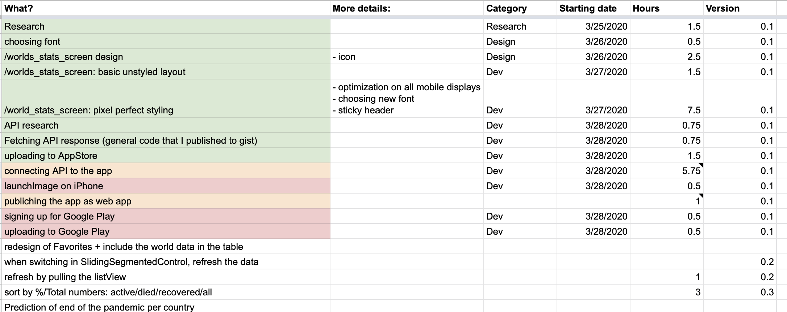

# COVID-19 Tracker

## Vision

Collect data by the community and scan whether we are surrounded by anyone that potentially could be contagious (via BT and GPS). 

## Screenshot of 0.1 version

## Live link: [covid19-world-tracker.web.app](https://covid19-world-tracker.web.app)
Live web app created by Flutter. For best experience open it up on a smart phone with high performance processor. Web apps created by Flutter at this point (Apr 2, 2020) are in beta and therefore lack performance.

#### Project Discountinuation [Apr 2, 2020] 
The project was discontinued due to Apple's and Google's restriction on apps that try to fight the COVID-19 epidemic unless are published by governments or health organizations.

## Summary
It was a 25 hour-long project in total.

 
